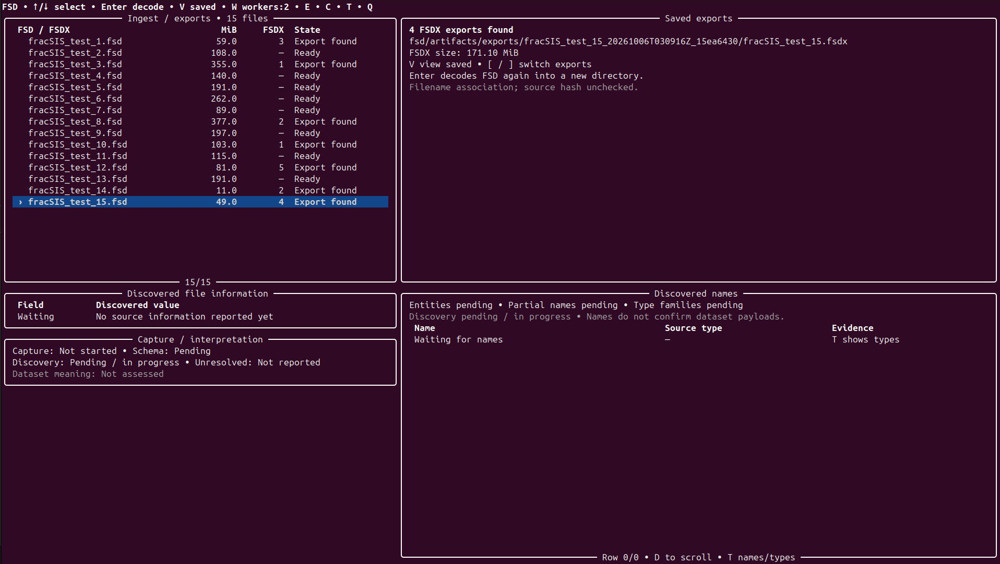
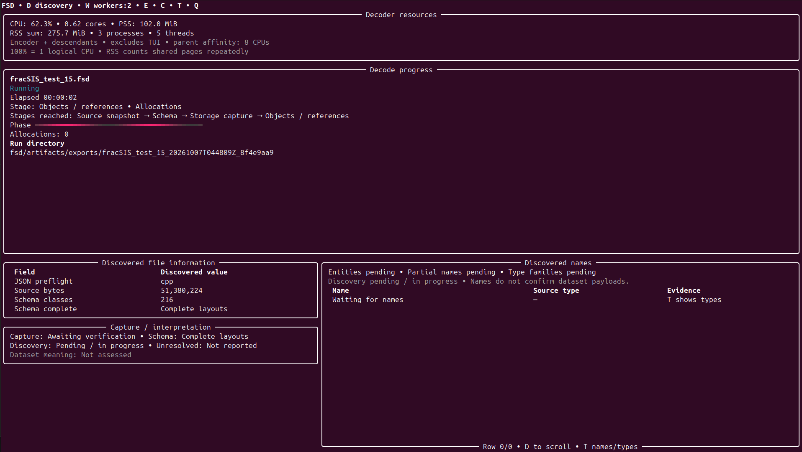
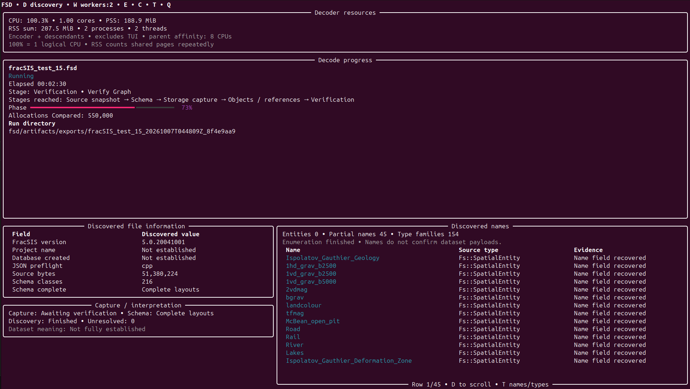
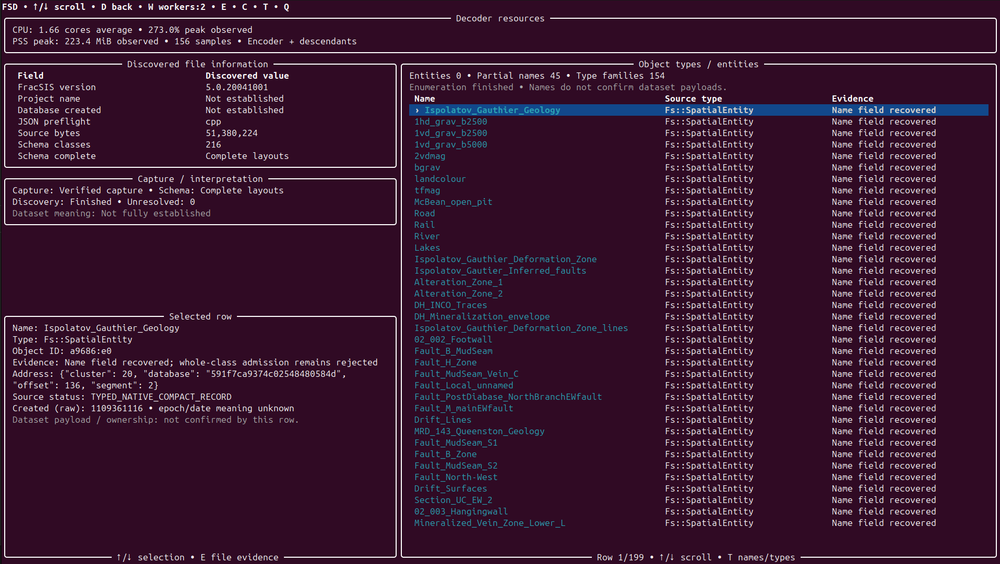
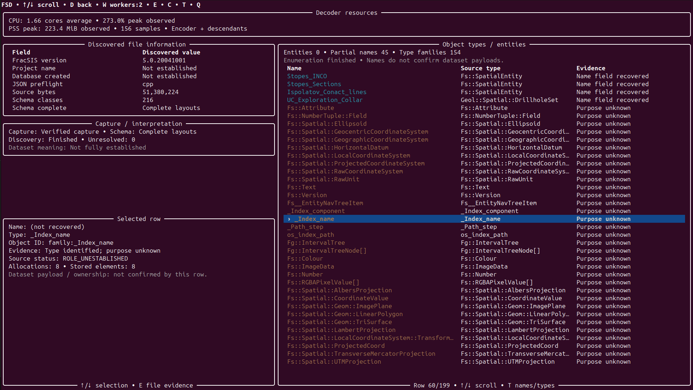

# FSD decoder and FSDX archive

A Python tool for recovering data from observed FracSIS/ObjectStore `.fsd`
layouts and capturing it in a standalone SQLite `.fsdx` archive. Version
**0.1.45** includes a command-line decoder, archive inspection commands, a
separate Rich terminal interface and an optional C++ acceleration helper.

The decoder reads the selected source to discover its schema, storage objects,
names and metadata. It records source hashes, addresses, unresolved states and
capture provenance. Once captured, the FSDX can be inspected without reopening
the original FSD. Single-file decoding and terminal intake use no project-name
manifest or historical file identity lookup to initialise native parsing. The
separate corpus workflow accepts an explicit workload manifest, described below.

This is an empirical recovery implementation. Complete application semantics,
all dataset ownership, coordinate systems and units are **not established**.
Allocations, stored elements, named objects, geometry records and confirmed
datasets are different quantities. Structural verification establishes the
archive's integrity within the implemented checks; it does not establish
complete semantic decoding or support for every FSD layout.

## Requirements

- CPython **3.12–3.14** is the declared interpreter range; use Linux x86_64.
  The latest installed-package validation used CPython 3.12.3 on Linux x86_64.
  That result does not verify the current release on every declared interpreter.
- The core reader and encoder use the Python standard library. The optional
  terminal interface requires Rich, installed by the setup below.
- Installation uses `setuptools>=84`. A C++17 compiler and Python development
  headers enable the optional native helper. Missing or unloadable native code
  uses the Python fallback; decoding does not compile code or require vendor
  software.

`pyproject.toml` defines dependencies. `requirements.txt` installs the package
with its terminal-interface extra.

## Setup

Use `fsd/` as the repository root. For an extracted source ZIP, enter its `fsd`
directory; for a Git checkout, enter the directory containing `pyproject.toml`.
Run these commands there:

```bash
mkdir -p artifacts/cache artifacts/build artifacts/scratch artifacts/exports
export FSD_PROJECT_ROOT="$PWD"
export FSD_ARTIFACT_ROOT="$PWD/artifacts"
export TMPDIR="$PWD/artifacts/scratch"
export PIP_CACHE_DIR="$PWD/artifacts/cache/pip"
export PYTHONDONTWRITEBYTECODE=1
python3 -B -m venv artifacts/cache/venv
artifacts/cache/venv/bin/python -B -m pip install -r requirements.txt
```

For a core-only installation, replace the last command with:

```bash
artifacts/cache/venv/bin/python -B -m pip install .
```

No original databases or generated exports are distributed. Place an FSD you
want to process in `ingest/`. Keep originals intact; all commands below put
outputs under `artifacts/`. If you start another shell, reapply the environment
variables above before installing or building.

## Decode one FSD

Replace `example.fsd` with your input filename:

```bash
artifacts/cache/venv/bin/fsd-encode ingest/example.fsd \
  --output artifacts/exports/example.fsdx
```

This runs a full capture and verification, then publishes the FSDX. Structured
progress is written to stderr and the result summary to stdout. An existing
output destination is refused: choose a new filename for another run.

Capture completion, full verification, publication and synchronization are
separate steps. `StoreWriter.finish()` commits a `COMPLETE` staging store before
its final close and file sync; the encoder then verifies it and compares it with
the source before publication. A later error can leave a completed staging store,
or a verified destination if publication succeeded before directory sync or
result reporting failed. Completion does not mean every pointer or application
field is understood.

The FSDX manifest field `pointer_resolution_complete` records completion of the
supported pointer-binding enumeration. When true, a missing binding with an
all-zero stored word may be read as null. Recorded bindings take precedence:
explicit `UNRESOLVED` entries remain unresolved, and a missing nonzero binding
is an error. This field does not assert that every reference has a resolved
target; consult pointer statuses and the recorded unresolved count.

FSDX is this project's archive format. It retains mapped logical content and
metadata, rather than every free, deallocated or unmapped physical byte. Preserve
the original FSD even after successful capture.

## Inspect an FSDX

```bash
# File information, source provenance and stored coverage
artifacts/cache/venv/bin/fsd-output artifacts/exports/example.fsdx info

# Source-derived schema saved as plain-text JSON
artifacts/cache/venv/bin/fsd-output artifacts/exports/example.fsdx schema \
  --output artifacts/exports/example_schema.json

# Discovered names and grouped storage roles, with interpretation limits
artifacts/cache/venv/bin/fsd-output artifacts/exports/example.fsdx datasets

# Dataset, geometry, relationship and coordinate-system evidence
artifacts/cache/venv/bin/fsd-output artifacts/exports/example.fsdx catalog

# Full archive verification without the original FSD
artifacts/cache/venv/bin/fsd-output artifacts/exports/example.fsdx verify
```

Inspection commands above print JSON unless given `--output` with a new file
path. Unknown or unconfirmed results remain explicit; a discovered name or type
family alone does not prove that an application dataset has been decoded.
Use `fsd-output --help` and a subcommand's `--help` for further options.

## Corpus orchestration and resume scope

`fsd-corpus` coordinates batch encoding or baseline validation. It requires
`--sources` with a JSON list of records containing `label`, `path`, `bytes` and
`sha256`; `--phase validate` also requires `--baseline-root`. These supplied
labels and expected file identities coordinate and admit the workload. They
do not supply discovered project names, object layouts or dataset relationships
to native parsing. Single-file decoding and terminal intake do not use this
manifest workflow.

Corpus reuse is at completed project boundaries. Census and membership ledgers
can retain allocation/element or supported node/slot progress. These are separate
analysis checkpoints; none resumes an interrupted native capture transaction.

## Terminal interface

From the project root, in an interactive terminal:

```bash
artifacts/cache/venv/bin/python -B tools/fsd_tui.py
```

The interface lists ingest filenames and sizes, detects saved exports and shows
live decoding progress, discovered information, elapsed time in HH:MM:SS, and
CPU/RAM measurements for the decoder and its descendants. It processes one FSD
at a time and creates a separate run directory under `artifacts/exports/`.

### Screenshots

These screenshots show one example session. Counts, timings and resource readings
belong to that session. Recovered names do not establish dataset payloads or
ownership, and a verified capture does not establish complete application meaning.

**File selection and saved exports.** Browse input files, inspect saved exports,
or start a fresh decode. Saved filename associations do not verify source identity.



**Capture in progress.** The file list gives way to decoding stages, elapsed time,
CPU and memory observations, and information discovered from the source.



**Verification in progress.** Names can appear before capture verification finishes;
the interface presents those states separately.



**Recovered names and row evidence.** Scroll through names and inspect the selected
record's source type, address and interpretation limits.



**Object types and unresolved meaning.** Browse type families alongside recovered
names. Allocation and stored-element counts remain separate from dataset counts.



| Key | Action |
| --- | --- |
| Up / Down, or K / J | Select a file or scroll the open discovery/evidence view |
| Enter | Decode the selected FSD from the overview, including a fresh decode |
| V | Open a saved export for the selected file |
| [ / ] | Switch between saved exports for that file |
| D | Toggle discovered names and objects |
| T | Switch discovery between names and type families |
| E | Toggle file evidence |
| W | Choose 1, 2 or 4 preparation workers for the next decode |
| R | Refresh ingest files and saved exports |
| C | Request cancellation of an active decode |
| Q | Quit, stopping an active decode first |

Return from discovery/evidence to the overview before starting another decode.
Saved export details are retained evidence, not a fresh verification or proof
that the current source is unchanged. They never seed a new decode.

## Workers and optional C++ acceleration

Serial preparation is the default. To try two workers on the same file, use a
new output path:

```bash
artifacts/cache/venv/bin/fsd-encode ingest/example.fsd \
  --output artifacts/exports/example_workers2.fsdx --workers 2
```

Worker preparation is experimental; pointer capture and verification remain
ordered. Additional workers can increase memory consumption and do not guarantee
shorter total runtime.

Installation attempts to build the optional C++ helper. To build the helper
used by the source-checkout interface separately:

```bash
artifacts/cache/venv/bin/python -B -m pip install 'setuptools>=84'
artifacts/cache/venv/bin/python -B tools/build_native.py
```

The helper accelerates JSON UTF-8/depth screening, canonical SQL-row framing
and bounded row-size estimation. Python owns FSD interpretation and integrity
policy. Do not rebuild or reinstall during an active capture. To select the
Python fallback for a command in a fresh process:

```bash
FSD_JSON_BACKEND=python artifacts/cache/venv/bin/fsd-encode ingest/example.fsd \
  --output artifacts/exports/example_python.fsdx
```

## Repository layout and research

```text
.
├── README.md
├── pyproject.toml
├── requirements.txt
├── setup.cfg
├── setup.py
├── ingest/                 # Supply original FSD files here; contents ignored
├── src/fsd_decoder/        # Canonical implementation and packaged resources
├── tools/                  # Terminal interface, native build and maintenance
├── docs/paper/             # Academic methods paper
└── artifacts/              # Generated outputs, environments, caches and builds
```

The [academic paper — rendered HTML](https://clear1nsight.github.io/fsdx/paper/fsd_recovery_paper.html)
describes the recovery method, development history, architecture decisions and
evidence limits. For offline reading, open
[`docs/paper/fsd_recovery_paper.html`](docs/paper/fsd_recovery_paper.html) in a web
browser. GitHub's repository file view shows HTML source; the rendered link uses
GitHub Pages.

To publish the reader in [Clear1nsight/fsdx](https://github.com/Clear1nsight/fsdx/),
upload these maintained files, then open **Settings → Pages**. Select **Deploy
from a branch**, choose **main** and **/docs**, and save. The hosted link becomes
available after the Pages deployment completes. `docs/index.html` opens the
paper from the site root, and `docs/.nojekyll` serves the maintained HTML without
a Jekyll build. See [GitHub's publishing-source guide](https://docs.github.com/en/pages/getting-started-with-github-pages/configuring-a-publishing-source-for-your-github-pages-site).

The public source includes this README, the paper's synchronized Markdown and
HTML, the Pages entry files, and the curated README screenshots. Local tests, other
documents, agent/skill instructions, investigations, original inputs and generated
artifacts are excluded from Git. A source-only checkout does not contain the
local test suite or private research evidence.

Generated files belong in `artifacts/`; that directory is created during setup.
For routine layout checking and Python cache cleanup, run:

```bash
artifacts/cache/venv/bin/python -B tools/maintain_workspace.py --clean-caches
```

Cleanup preserves original inputs, FSDX stores and retained evidence. A
redistribution license has not yet been selected.
